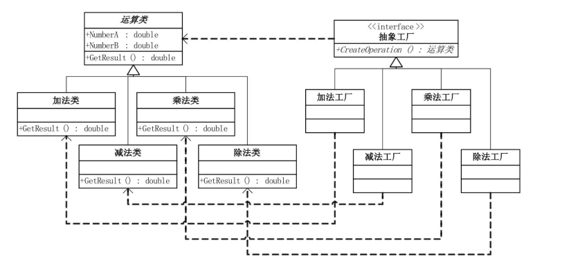

# 工厂方法模式 (Factory Method Pattern)

## 模式概述

工厂方法模式是一种创建型设计模式，它通过定义一个用于创建对象的接口，让子类决定实例化哪一个类。工厂方法将对象的创建过程延迟到子类中进行，从而实现了对象创建的灵活性和可扩展性。该模式主要解决了在软件开发中，如何将对象的实例化过程与使用过程解耦，使得系统在不修改现有代码的情况下可以引入新的产品类型。

工厂方法模式通常包含以下角色：
- **抽象工厂(AbstractFactory)**：声明用于创建产品对象的工厂方法。
- **具体工厂(ConcreteFactory)**：实现工厂方法，生成具体的产品对象。
- **抽象产品(Product)**：定义产品的公共接口。
- **具体产品(ConcreteProduct)**：实现抽象产品接口的具体类。
- **客户端(Client)**：通过工厂接口获取产品对象，屏蔽了具体产品的实现细节。

## 类图

## 优缺点分析
- 优点
  - 提高系统的灵活性和可扩展性，能够方便地引入新的产品类型而无需修改客户端代码。
  - 实现了对象创建与使用的解耦，降低了代码的耦合度。
  - 满足开闭原则，新增产品只需扩展工厂类即可。
  - 可以结合其他模式（如单例、模板方法等）进一步增强系统设计。

- 缺点
  - 增加了系统的复杂度，需要额外编写工厂类，导致类数量增多。
  - 每新增一种产品都需要实现对应的工厂，可能导致代码冗余。
  - 某些情况下可能导致代码结构过于抽象，理解和维护成本提升。