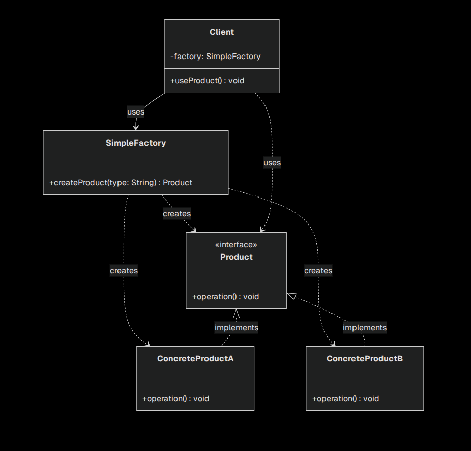

# 简单工厂模式（Simple Factory Pattern）

## 模式概述
简单工厂模式，又称静态工厂方法模式（Static Factory Method Pattern），它定义了一个工厂类，通过传入的参数决定创建哪一种产品类的实例。客户端无需知道具体创建对象的实现细节，只需调用工厂类即可获取所需的对象。

- 模式类型：创建型
- 角色：
  - **工厂（Factory）**：负责创建各种具体产品的实例。
  - **抽象产品（Product）**：定义了产品的公共接口。
  - **具体产品（ConcreteProduct）**：实现抽象产品接口的具体类。
  - **客户端（Client）**：通过工厂调用接口创建具体产品。

## 类图

## 优缺点

- 优点：
  - 由工厂类集中创建对象，客户端无需知道具体产品的实现细节。
  - 扩展性：新增产品时，只需添加对应的工厂分支和具体产品类。
- 缺点：
  - 工厂类集中了所有对象创建逻辑，当产品种类增多时，责任会过重，违反单一职责原则。
  - 不易于扩展：新增产品需要修改工厂类，存在一定的风险。
  - 违反了开闭原则：工厂类需要修改(添加新分支)才能支持新产品。
